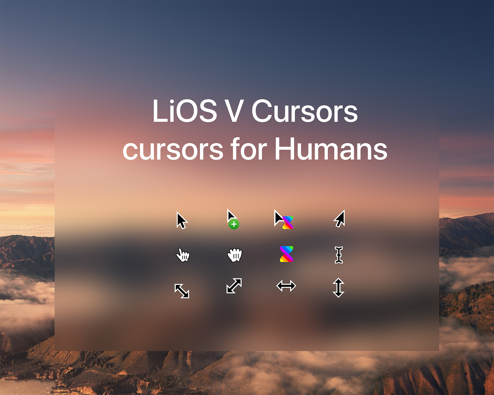

# LiOS V Cursors

<a href="https://www.buymeacoffee.com/AdityaMS"></a>

This is an x-cursor theme inspired by macOS and [posy's cursor](http://www.michieldb.nl/other/cursors/) made for Linux.
The source files were made in Illustrator and converted to svg.

This cursor should scale appropriately for any display resolution.

The Build script was copied and modified from [capitaine-cursors](https://github.com/keeferrourke/capitaine-cursors)



## Supported DPIs

This cursor pack aims to support all [named pixel densities][named-dpi].

[named-dpi]: https://en.wikipedia.org/wiki/Pixel_density#Named_pixel_densities

| Name    | Build option name | Rendered density (DPI) | Scale          |
| :------ | :---------------- | :--------------------- | :------------- |
| LODPI   | `-d lo`           | 96-144                 | x1, 1.25, x1.5 |
| TVDPI   | `-d tv` (default) | 192                    | x2             |
| HDPI    | `-d hd`           | 240                    | x2.5           |
| XHDPI   | `-d xhd`          | 288                    | x3             |
| XXHDPI  | `-d xxhd`         | 384-480                | x4, x5         |
| XXXHDPI | `-d xxxhd`        | 576+                   | x6, x10        |

## Building from source

Building from source can take a really long time, depending on the max specified DPI. 
Pre-built packages are available for download.

That said, you'll find everything you need to build and modify this cursor set in the `src/` directory.

Make sure `inkscape` and `xcursorgen` are installed

```
sudo apt install inkscape x11-apps          # Debian, Ubuntu based distros
sudo dnf install inkscape xorg-x11-apps     # Fedora, EPEL based distros
brew cask install xquartz inkscape          # macOS
```

Then run the provided script:

```
./build.sh
```

This will generate the pixmaps and appropriate aliases.
The freshly compiled cursor theme will be located in the `dist/` folder.

The script has a few options described below:

| Option | Values          | Description                     |
| :----- | :-------------- | :------------------------------ |
| `-p`   | `unix`, `win32` | Build for BSD/Linux, or Windows |
| `-t`   | `dark`, `light` | Choose the variant to build     |
| `-d`   | See DPIs        | Set the max DPI to render       |

<small>*Note: building the win32 cursors from source is not currently supported, but it is on the roadmap.</small>

## Pre-built binaries

Pre-built binaries are available for download at Pling

## Installation

### \*NIXes, \*BSDs, and possibly others

To install the cursor theme simply copy the theme to your icons directory.
For local user installation:

```bash
mkdir -p ~/.icons/LiOSV
cp -pr path/to/theme/ ~/.icons/LiOSV
```

For system-wide installation for all users:

```
sudo cp -pr path/to/theme/ /usr/share/icons/LiOSV
```

Then set the theme with your preferred desktop tools.

## License

LiOS V cursors is LGPLv3. See COPYING for more details.
